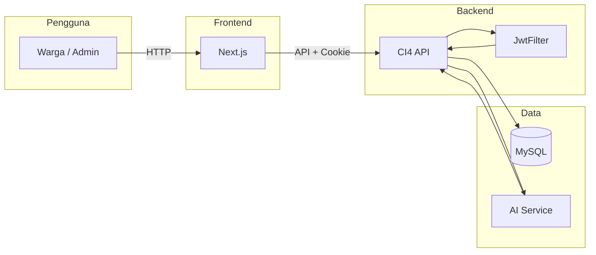
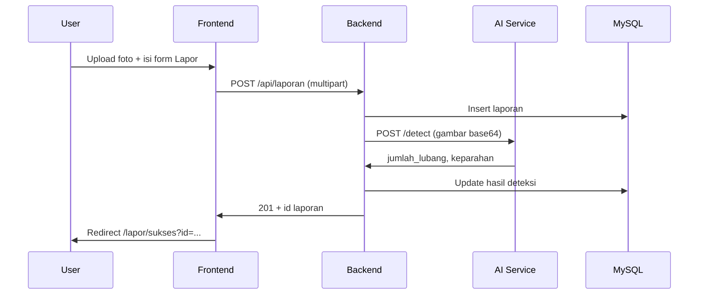

# Alur Sistem Jalur

Dokumen ini menjelaskan cara kerja sistem **Jalur** (laporan jalan berlubang) dari sisi pengguna dan dari sisi teknis, agar mudah dipahami.

---

## 1. Gambaran Besar

**Jalur** adalah aplikasi web untuk:
- **Warga:** melaporkan jalan berlubang dengan foto + lokasi, lalu mengecek status laporan tanpa harus login.
- **Admin:** melihat daftar laporan, statistik, peta, dan mengelola data (setelah login).

Alur singkat: **Foto jalan diupload → Backend simpan → AI deteksi lubang → Hasil tampil di dashboard & bisa dicek publik.**

---

## 2. Komponen Sistem

```
┌─────────────┐     HTTP      ┌─────────────┐     HTTP      ┌─────────────┐
│   Browser   │ ◄──────────►  │   Frontend  │ ◄──────────►  │   Backend   │
│  (pengguna) │   localhost   │  Next.js    │   localhost   │  CodeIgniter │
└─────────────┘     :3010     │  (React)    │     :8010     │  (PHP)      │
                              └─────────────┘               └──────┬──────┘
                                                                    │
                                    ┌───────────────────────────────┼───────────────────────────────┐
                                    │                               │                               │
                                    ▼                               ▼                               ▼
                             ┌─────────────┐                 ┌─────────────┐                 ┌─────────────┐
                             │   MySQL     │                 │ AI Service  │                 │   Cookie    │
                             │  (database) │                 │  (YOLO)     │                 │  (login)    │
                             └─────────────┘                 └─────────────┘                 └─────────────┘
```

| Komponen   | Peran |
|-----------|--------|
| **Frontend** | Tampilan web (form lapor, login, dashboard, peta). Berjalan di browser user, memanggil Backend lewat HTTP. |
| **Backend**  | API (CodeIgniter 4): simpan laporan, login, ambil daftar laporan, statistik, peta. Bicara ke MySQL dan AI Service. |
| **MySQL**    | Menyimpan data: user admin, laporan (foto, lokasi, status, hasil deteksi). |
| **AI Service** | Menerima gambar, menjalankan model YOLO untuk deteksi lubang, mengembalikan jumlah lubang & keparahan. Hanya dipanggil Backend (tidak langsung dari browser). |
| **Cookie**    | Setelah login, Backend mengirim token JWT lewat cookie (httpOnly). Frontend mengirim cookie itu di setiap request ke API yang butuh auth. |

---

## 3. Alur Sisi Pengguna

### 3.1 Warga: Buat Laporan (Tanpa Login)

1. Buka **Beranda** → klik **Lapor**.
2. Isi form: **upload foto jalan**, (opsional) ambil lokasi GPS, isi nama, HP, alamat, catatan.
3. Klik **Kirim**.
4. Frontend mengirim foto + data ke Backend (**POST /api/laporan**).
5. Backend menyimpan file foto dan data ke database, lalu memanggil **AI Service** dengan gambar tersebut.
6. AI mengembalikan: jumlah lubang terdeteksi, keparahan (ringan/sedang/parah). Backend menyimpan hasil dan mengembalikan **nomor laporan (ID)** ke Frontend.
7. Frontend mengalihkan ke halaman **Sukses** (`/lapor/sukses?id=...`) yang menampilkan nomor laporan dan link “Lihat detail” / “Login untuk melihat detail”.

**Ringkas:** Upload foto → Backend simpan + AI deteksi → Halaman sukses + nomor laporan.

---

### 3.2 Warga: Cek Status Laporan (Tanpa Login)

1. Buka menu **Cek Status**.
2. Masukkan **nomor laporan** (ID yang didapat setelah kirim laporan).
3. Frontend memanggil **GET /api/publik/laporan/:id** (tanpa login).
4. Backend mengembalikan: status (terdeteksi/diproses/selesai), keparahan, jumlah lubang, tanggal.
5. Frontend menampilkan hasil. Jika user ingin lihat detail lengkap (foto hasil, dll.), bisa klik “Lihat detail” → akan diminta login dulu.

**Ringkas:** Input nomor → API publik → Tampil status.

---

### 3.3 Admin: Login

1. Buka **Login**, isi email dan password (mis. `admin@localhost` / `admin123`).
2. Frontend mengirim **POST /api/auth/login** dengan email & password.
3. Backend memeriksa di database; jika benar, buat **JWT** dan mengirimkannya lewat **cookie** (httpOnly) + mengembalikan data user di body JSON.
4. Frontend tidak menyimpan token di JavaScript; cookie otomatis dikirim browser ke Backend pada request berikutnya.
5. Frontend mengalihkan ke **Dashboard** (atau ke halaman yang diminta lewat `?redirect=...`).

**Ringkas:** Email + password → Backend cek DB → Set cookie JWT → Redirect ke dashboard.

---

### 3.4 Admin: Dashboard & Daftar Laporan

1. Setelah login, buka **Dashboard** atau **Daftar Laporan**.
2. Frontend memanggil **GET /api/dashboard/stats** dan **GET /api/dashboard/peta** (atau **GET /api/laporan** untuk daftar). Setiap request mengirim **cookie**; Backend memvalidasi JWT dari cookie.
3. Backend mengembalikan data (statistik, marker peta, atau list laporan). Frontend menampilkan grafik, peta, dan tabel.
4. Filter (status, keparahan) mengubah parameter URL dan request API dengan query yang sesuai.

**Ringkas:** Request + cookie → Backend baca JWT → Ambil data dari DB → Tampil di halaman.

---

### 3.5 Admin: Lihat Detail Satu Laporan

1. Dari daftar atau peta, klik satu laporan → masuk ke **Detail Laporan** (`/laporan/[id]`).
2. Frontend memanggil **GET /api/laporan/:id** dengan cookie.
3. Backend mengembalikan data lengkap (foto asli, foto hasil deteksi, koordinat, status, keparahan, dll.).
4. Frontend menampilkan semuanya di halaman detail.

**Ringkas:** Klik laporan → Request + cookie → Detail dari DB → Tampil.

---

### 3.6 Peta & Halaman Publik Lainnya

- **Peta** (`/peta`): Frontend memanggil **GET /api/publik/peta** (tanpa login). Backend mengembalikan daftar titik laporan untuk ditampilkan di peta.
- **Cara Pakai** dan **Tentang**: Halaman statis di Frontend, tidak memanggil API khusus.
- **Profil** (setelah login): Menampilkan data user dari **GET /api/auth/me** dan form ubah password (**POST /api/auth/ubah-password**).

---

## 4. Alur Teknis Singkat (Request ke Response)

### Contoh: Submit Laporan (POST /api/laporan)

```
Browser (Form)  →  POST /api/laporan (foto + form data)
                        ↓
Backend (CI4)   →  Simpan file ke disk, insert record ke MySQL (status default)
                        ↓
Backend         →  POST gambar (base64) ke AI Service /detect
                        ↓
AI Service      →  YOLO predict → return jumlah_lubang, keparahan, confidence
                        ↓
Backend         →  Update record laporan (foto_hasil, jumlah_lubang, keparahan)
                        ↓
Backend         →  Response 201 + data laporan (termasuk id)
                        ↓
Frontend        →  Redirect ke /lapor/sukses?id=...
```

### Contoh: Request yang Butuh Login (mis. GET /api/laporan)

```
Browser         →  GET /api/laporan + Cookie: jalur_token=...
                        ↓
Backend (JwtFilter)  →  Baca token dari cookie → decode JWT → cek valid
                        ↓
                        Jika valid: set request->user_id, lanjut ke Controller
                        Jika tidak: response 401
                        ↓
LaporanController   →  Query MySQL, return JSON daftar laporan
                        ↓
Browser         →  Terima JSON, tampilkan di halaman
```

---

## 5. Diagram Alur Utama (Mermaid)

Diagram di bawah bisa dilihat di editor yang mendukung Mermaid (mis. VS Code dengan ekstensi, atau GitHub).





---

## 6. Ringkasan Per Endpoint Penting

| Endpoint | Method | Auth | Keterangan |
|----------|--------|------|------------|
| `/api/auth/ping` | GET | Tidak | Cek backend hidup |
| `/api/auth/login` | POST | Tidak | Login → set cookie + return user |
| `/api/auth/me` | GET | Cookie | Data user saat ini |
| `/api/auth/logout` | POST | Cookie | Hapus cookie |
| `/api/auth/ubah-password` | POST | Cookie | Ganti password |
| `/api/laporan` | GET | Cookie | Daftar laporan (filter) |
| `/api/laporan` | POST | Tidak | Buat laporan (foto + data) |
| `/api/laporan/:id` | GET | Cookie | Detail satu laporan |
| `/api/publik/laporan/:id` | GET | Tidak | Status ringkas laporan (untuk Cek Status) |
| `/api/publik/peta` | GET | Tidak | Data marker peta (publik) |
| `/api/dashboard/stats` | GET | Cookie | Statistik dashboard |
| `/api/dashboard/peta` | GET | Cookie | Data peta (sama seperti publik, dengan auth) |

---

Dengan alur di atas, Anda bisa melacak dari mana data berasal (form, database, AI) dan ke mana request mengalir (Frontend → Backend → DB/AI → response ke pengguna). Jika ada fitur baru, tempatkan di diagram dan tabel ini agar konsisten.
